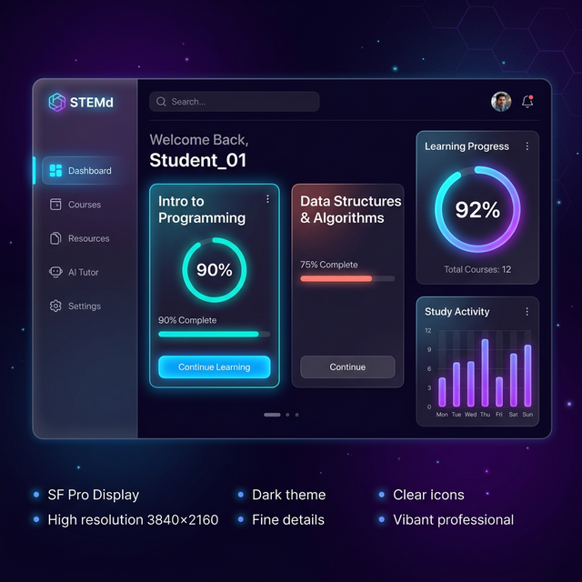
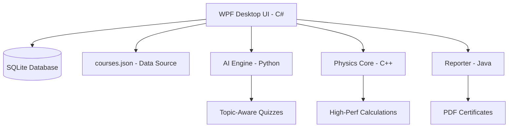

# STEMd: Polyglot AI-Driven Learning Platform 🚀

STEMd is a state-of-the-art, 100% dynamic desktop application designed to revolutionize STEM education. Built for a high-performance hackathon environment, it seamlessly integrates five different programming environments into a unified, glassmorphic experience.



## 🌟 Key Features

### 1. Unified Data-Driven Engine
- **No Hardcoded Content**: All courses, topics, resources, and milestones are dynamically loaded from a unified `courses.json` architecture.
- **Adaptive Progression**: Real-time progress tracking (Completed, In-progress, Locked) driven by a local SQLite database and C# Course Engine.

### 2. Polyglot Masterclass 🛠️
The platform leverages the strengths of multiple languages:
- **C# (WPF)**: The primary orchestrator and high-fidelity desktop UI.
- **Python (AI Engine)**: Topic-aware quiz generation and an adaptive academic tutor.
- **C++ (Sim Core)**: High-performance projectile motion and physics calculations.
- **Java (Analytics)**: Robust reporting and achievement certificate generation.
- **SQLite**: Local, persistent storage for student data.

### 3. Smart AI Integration
- **Context-Aware Tutor**: The AI assistant understands your selected major and current lesson.
- **Dynamic Quiz Banks**: Quizzes are randomized and technically accurate for every specific STEM topic.

### 4. Premium UX/UI
- Glassmorphic design with deep purple aesthetics.
- Responsive dashboard with real-time performance analytics.
- Major-specific library resources and virtual labs.

## 🚀 Quick Start

1. **Prerequisites**:
   - .NET 9.0 SDK
   - Python 3.x
   - Java JDK 17+
   - C++ Compiler (for simulation builds)

2. **Run the App**:
   Simply execute the `run.bat` file in the root directory:
   ```cmd
   ./run.bat
   ```

## 🏗️ Architecture Overview



## 🌐 Project Context
This project was transformed from a static prototype into a production-ready system during an intensive overhaul session. It demonstrates excellence in cross-language integration, dynamic data-binding, and modern desktop UI design.

---
Created by **MuthamiM** for the STEMd Polyglot Hackathon.
